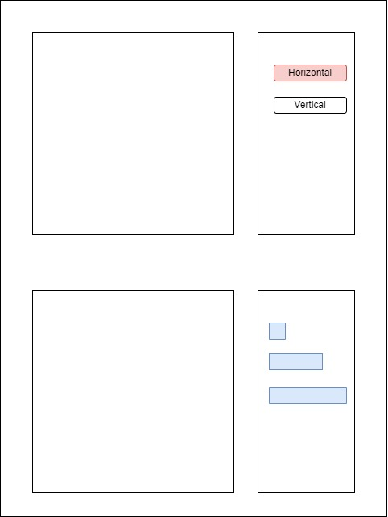
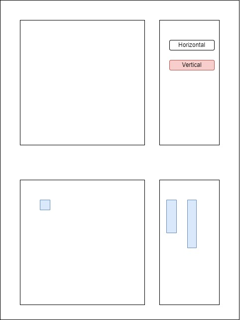

# Battleship

- look for different implementations of the game available online; Done
- think of how the game should be structured and work; Done
- think of what the user interactions would be in order to play the game (all possible interactions with the game):
    1. choose single player or two players
    2. select placement for the ships (random or manual)
        - Horizontal:
    
        - Vertical:
    

  3. (two players version) Repeat:
      1. Select a cell on the opponent field;
      2. check if struck or not;
      3. color the cell in white (not struck) or red (struck);
      4. wait opponents move, or end the game if all the ships are sunk

      (bot version) Repeat:
      1. Select a cell on the opponent field;
      2. check if struck or not;
      3. color the cell in white (not struck) or red (struck);
      4. for next move, if struck, select an adjacent cell and remember the direction (if previous move was struck, do not change direction, otherwise select an adjacent cell referring to the previous move by changing direction);
      5. wait opponents move, or end the game if all the ships are sunk

- interactions with the backend

    API REST using the following resources.

    Resources:
    - grid
        - player
        - cells
            - ship / no-ship
            - struck / not struck

